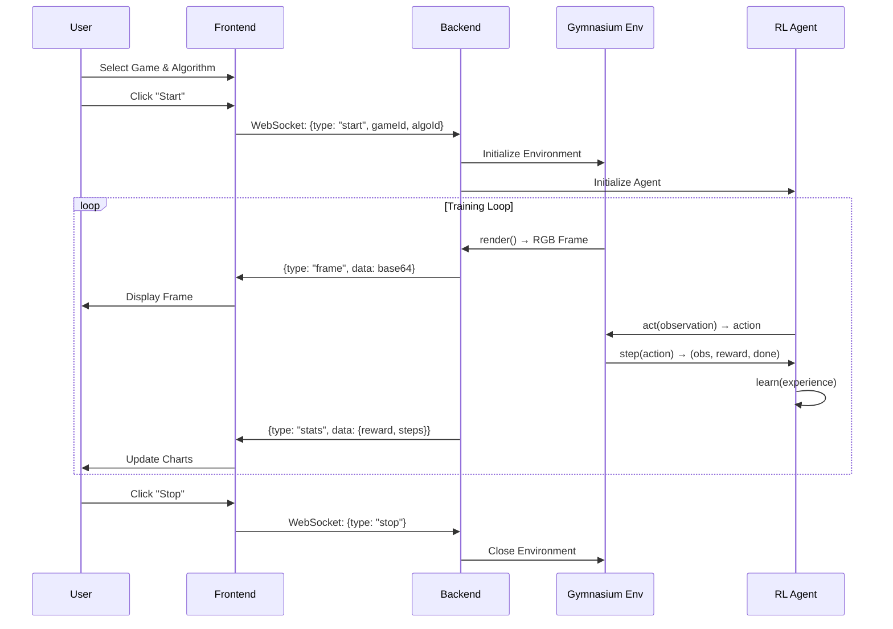

# RL Arena - Complete Project Documentation

> **Last Updated**: December 12, 2025  
> **Version**: 2.0.0

---

## Table of Contents

1. [A. High-Level Documentation](#a-high-level-documentation)
   - [Project Overview](#project-overview)
   - [Architecture Description](#architecture-description)
   - [End-to-End System Flow](#end-to-end-system-flow)
   - [Technologies Used](#technologies-used)
2. [B. Class-Level Documentation](#b-class-level-documentation)
3. [C. File-Level Documentation](#c-file-level-documentation)
4. [D. Requirement Mapping](#d-requirement-mapping)
5. [E. Developer-Friendly Instructions](#e-developer-friendly-instructions)

---

# A. High-Level Documentation

## Project Overview

**RL Arena** is an interactive web platform for visualizing and running Reinforcement Learning (RL) agents on classic game environments. The platform provides a real-time visual interface where users can:

- Select from multiple game environments:
  - **Tabular**: Taxi, Blackjack, FrozenLake, Jungle Dash (custom Pygame)
  - **Visual**: MsPacman, KungFuMaster, MiniWorld-Maze
- Choose RL algorithms (Dynamic Programming, Q-Learning, SARSA, DQN, Policy Gradient)
- Watch the AI agent play the game in real-time with live frame streaming
- Monitor training metrics (rewards, steps, penalties, episode progress) through interactive charts
- View agent action logs with color-coded messages

The project demonstrates the application of various RL algorithms taught in the AIE322 Advanced Machine Learning course, including:
- **Dynamic Programming**: Value Iteration for discrete state spaces
- **Temporal Difference Learning**: Q-Learning (off-policy) and SARSA (on-policy)
- **Deep Reinforcement Learning**: DQN (Deep Q-Network) and Policy Gradient methods

## Architecture Description

The system follows a **client-server architecture** with real-time WebSocket communication:

```
┌─────────────────────────────────────────────────────────────────────┐
│                           RL ARENA SYSTEM                           │
├─────────────────────────────────────────────────────────────────────┤
│                                                                     │
│  ┌─────────────────────┐          ┌────────────────────────────┐   │
│  │   FRONTEND (React)  │◄────────►│    BACKEND (FastAPI)       │   │
│  │                     │WebSocket │                            │   │
│  │  ┌───────────────┐  │          │  ┌──────────────────────┐  │   │
│  │  │ Game Canvas   │  │  frames  │  │   TrainingManager    │  │   │
│  │  │ (Base64 Imgs) │◄─┼──────────┼──│                      │  │   │
│  │  └───────────────┘  │          │  │  ┌────────────────┐  │  │   │
│  │                     │          │  │  │  Gymnasium Env │  │  │   │
│  │  ┌───────────────┐  │  stats   │  │  └────────────────┘  │  │   │
│  │  │ Stats Panel   │◄─┼──────────┼──│                      │  │   │
│  │  │ (Recharts)    │  │          │  │  ┌────────────────┐  │  │   │
│  │  └───────────────┘  │          │  │  │   RL Agent     │  │  │   │
│  │                     │ commands │  │  └────────────────┘  │  │   │
│  │  ┌───────────────┐  │          │  └──────────────────────┘  │   │
│  │  │ Controls      ├──┼──────────┼─►                          │   │
│  │  │ (Start/Stop)  │  │          │                            │   │
│  │  └───────────────┘  │          └────────────────────────────┘   │
│  └─────────────────────┘                                           │
│                                                                     │
└─────────────────────────────────────────────────────────────────────┘
```

### Components:

1. **Frontend (React/TypeScript)**
   - Single-page application with game selection, algorithm selection, and visualization
   - Real-time frame rendering from Base64-encoded images
   - Live training metrics displayed via Recharts line graphs

2. **Backend (Python/FastAPI)**
   - WebSocket server for bidirectional communication
   - Environment management using Gymnasium
   - RL agent implementations (DQN, Policy Gradient, Tabular methods)
   - Real-time frame encoding and statistics broadcasting

3. **RL Agents**
   - Modular agent architecture with common `BaseAgent` interface
   - Deep RL agents using PyTorch (DQN, Actor-Critic)
   - Tabular agents for discrete environments (Q-Learning, DP)

## End-to-End System Flow



**Detailed Flow:**

1. **User Selection**: User selects a game and an algorithm:
   - **Tabular Games**: Taxi, Blackjack, FrozenLake, Jungle Dash (support DP, Q-Learning, SARSA)
   - **Visual Games**: MsPacman, KungFuMaster, MiniWorld-Maze (require DQN/PG)

2. **Start Training**: 
   - Frontend sends `start` command via WebSocket
   - Backend creates the appropriate Gymnasium environment
   - Backend initializes the corresponding RL agent

3. **Training Loop**:
   - Environment renders current frame → encoded to JPEG → Base64 → sent to frontend
   - Agent selects action based on observation
   - Environment executes action, returns new state and reward
   - Agent learns from the experience
   - Statistics sent to frontend every 10 steps

4. **Stop Training**:
   - User clicks Stop → frontend sends `stop` command
   - Backend terminates training loop and closes environment

## Technologies Used

| Category | Technology | Purpose |
|----------|------------|---------|
| **Frontend** | React 18 | UI framework |
| | TypeScript | Type safety |
| | Vite | Build tool & dev server |
| | TailwindCSS | Utility-first styling |
| | Recharts | Data visualization |
| | Lucide React | Icon library |
| **Backend** | Python 3.10+ | Core language |
| | FastAPI | Web framework |
| | Uvicorn | ASGI server |
| | WebSockets | Real-time communication |
| **RL/ML** | Gymnasium | RL environment API |
| | PyTorch | Deep learning framework |
| | NumPy | Numerical computing |
| | OpenCV | Image processing |
| | ALE-py | Atari emulator |

---

# B. Class-Level Documentation

## Backend Classes

### `TrainingManager` (training.py)

**Purpose**: Orchestrates the training process, managing environment creation, agent initialization, and the training loop with real-time WebSocket broadcasting.

**Attributes**:
| Attribute | Type | Description |
|-----------|------|-------------|
| `env` | `gym.Env` | Current Gymnasium environment instance |
| `agent` | `BaseAgent` | Current RL agent instance |
| `running` | `bool` | Flag controlling the training loop |
| `episode_rewards` | `list[float]` | History of episode rewards |
| `current_episode_reward` | `float` | Accumulated reward in current episode |
| `total_steps` | `int` | Total steps across all episodes |
| `total_penalties` | `float` | Total penalties (negative rewards) |
| `episode_count` | `int` | Current episode number |
| `current_game_id` | `str` | ID of the currently loaded game |

**Methods**:
| Method | Parameters | Returns | Description |
|--------|------------|---------|-------------|
| `start_training` | `game_id: str, algo_id: str, websocket` | `None` | Async method that initializes environment/agent and runs training loop |
| `init_agent` | `algo_id: str, n_actions: int, input_shape: tuple, is_visual: bool` | `None` | Creates appropriate agent based on algorithm selection |
| `stop` | None | `None` | Stops training loop and closes environment |
| `send_log` | `websocket, message: str, log_type: str` | `None` | Sends log message to frontend |
| `get_action_name` | `action: int` | `str` | Returns human-readable action name |

**Interactions**:
- Creates and manages `DQNAgent`, `PolicyGradientAgent`, `TabularQLearningAgent`, `SARSAAgent`, or `DynamicProgrammingAgent`
- Uses `ResizeAndGrayscale` and `FrameStack` wrappers from `envs.wrappers`
- Uses `JungleDashEnv` from `envs.jungle_dash`
- Uses `BlackjackObsWrapper` for Blackjack observation space conversion
- Communicates with frontend via WebSocket

---

### `BaseAgent` (agents/base_agent.py)

**Purpose**: Abstract base class defining the interface that all RL agents must implement.

**Attributes**:
| Attribute | Type | Description |
|-----------|------|-------------|
| `action_space` | `gym.Space` | Environment's action space |

**Methods** (Abstract):
| Method | Parameters | Returns | Description |
|--------|------------|---------|-------------|
| `act` | `observation` | `int` | Select action given current observation |
| `step` | `state, action, reward, next_state, done` | `None` | Learn from experience tuple |
| `save` | `path: str` | `None` | Save model to disk |
| `load` | `path: str` | `None` | Load model from disk |

**Interactions**:
- Parent class for all agent implementations
- Enforces consistent interface across agent types

---

### `DQN` (agents/dqn.py)

**Purpose**: PyTorch neural network implementing the Deep Q-Network architecture with convolutional layers for image-based state processing.

**Attributes**:
| Attribute | Type | Description |
|-----------|------|-------------|
| `features` | `nn.Sequential` | CNN feature extractor (3 conv layers) |
| `fc` | `nn.Sequential` | Fully connected layers for Q-value output |

**Methods**:
| Method | Parameters | Returns | Description |
|--------|------------|---------|-------------|
| `_feature_size` | `input_shape: tuple` | `int` | Computes flattened feature size after convolutions |
| `forward` | `x: Tensor` | `Tensor` | Forward pass returning Q-values for all actions |

**Architecture**:
```
Input (CxHxW) → Conv2d(32, 8x8, stride=4) → ReLU
             → Conv2d(64, 4x4, stride=2) → ReLU
             → Conv2d(64, 3x3, stride=1) → ReLU
             → Flatten → Linear(512) → ReLU
             → Linear(n_actions) → Q-values
```

---

### `DQNAgent` (agents/dqn.py)

**Purpose**: Deep Q-Learning agent implementation with experience replay, target network, and epsilon-greedy exploration.

**Attributes**:
| Attribute | Type | Description |
|-----------|------|-------------|
| `model` | `DQN` | Online Q-network |
| `target_model` | `DQN` | Target Q-network for stability |
| `optimizer` | `Adam` | Network optimizer |
| `buffer` | `deque` | Experience replay buffer |
| `epsilon` | `float` | Exploration rate (starts at 1.0) |
| `epsilon_decay` | `float` | Decay rate per step (0.995) |
| `epsilon_min` | `float` | Minimum exploration (0.01) |
| `gamma` | `float` | Discount factor (0.99) |
| `batch_size` | `int` | Training batch size (32) |

**Methods**:
| Method | Parameters | Returns | Description |
|--------|------------|---------|-------------|
| `act` | `observation` | `int` | Epsilon-greedy action selection |
| `step` | `state, action, reward, next_state, done` | `None` | Store experience and train on batch |
| `update_target` | None | `None` | Copy weights to target network |
| `save` | `path: str` | `None` | Save model weights |
| `load` | `path: str` | `None` | Load model weights |

**Interactions**:
- Inherits from `BaseAgent`
- Used by `TrainingManager` for visual environments

---

### `ActorCritic` (agents/policy_gradient.py)

**Purpose**: PyTorch neural network implementing Actor-Critic architecture with shared CNN backbone.

**Attributes**:
| Attribute | Type | Description |
|-----------|------|-------------|
| `conv` | `nn.Sequential` | Shared CNN feature extractor |
| `actor` | `nn.Sequential` | Policy head (action probabilities) |
| `critic` | `nn.Sequential` | Value head (state value) |

**Methods**:
| Method | Parameters | Returns | Description |
|--------|------------|---------|-------------|
| `_get_conv_out` | `shape: tuple` | `int` | Compute flattened conv output size |
| `forward` | `x: Tensor` | `(Tensor, Tensor)` | Returns (action_logits, state_value) |

---

### `PolicyGradientAgent` (agents/policy_gradient.py)

**Purpose**: Actor-Critic agent using REINFORCE with baseline for policy gradient learning.

**Attributes**:
| Attribute | Type | Description |
|-----------|------|-------------|
| `model` | `ActorCritic` | Neural network |
| `optimizer` | `Adam` | Network optimizer |
| `log_probs` | `list` | Action log probabilities for current episode |
| `values` | `list` | State values for current episode |
| `rewards` | `list` | Rewards for current episode |
| `gamma` | `float` | Discount factor (0.99) |

**Methods**:
| Method | Parameters | Returns | Description |
|--------|------------|---------|-------------|
| `act` | `observation` | `int` | Sample action from policy distribution |
| `step` | `state, action, reward, next_state, done` | `None` | Store reward, update on episode end |
| `update` | None | `None` | Compute returns and update policy |

---

### `TabularQLearningAgent` (agents/q_learning.py)

**Purpose**: Classic tabular Q-Learning agent for discrete state/action spaces.

**Attributes**:
| Attribute | Type | Description |
|-----------|------|-------------|
| `q_table` | `np.ndarray` | Q-value table (states × actions) |
| `alpha` | `float` | Learning rate (0.1) |
| `gamma` | `float` | Discount factor (0.99) |
| `epsilon` | `float` | Exploration rate (0.1) |

**Methods**:
| Method | Parameters | Returns | Description |
|--------|------------|---------|-------------|
| `act` | `observation` | `int` | Epsilon-greedy action from Q-table |
| `step` | `state, action, reward, next_state, done` | `None` | Q-learning update rule |
| `save` | `path: str` | `None` | Save Q-table to .npy file |
| `load` | `path: str` | `None` | Load Q-table from file |

**Update Rule**: `Q(s,a) ← Q(s,a) + α[r + γ·max Q(s',a') - Q(s,a)]`

---

### `SARSAAgent` (agents/sarsa.py)

**Purpose**: On-policy SARSA agent for discrete state/action spaces. Key difference from Q-Learning: uses the actual next action taken instead of max Q-value.

**Attributes**:
| Attribute | Type | Description |
|-----------|------|-------------|
| `q_table` | `np.ndarray` | Q-value table (states × actions) |
| `alpha` | `float` | Learning rate (0.1) |
| `gamma` | `float` | Discount factor (0.99) |
| `epsilon` | `float` | Exploration rate (0.1) |
| `next_action` | `int` | Stored next action for SARSA update |

**Methods**:
| Method | Parameters | Returns | Description |
|--------|------------|---------|-------------|
| `act` | `observation` | `int` | Epsilon-greedy action selection |
| `step` | `state, action, reward, next_state, done` | `None` | SARSA on-policy update rule |
| `save` | `path: str` | `None` | Save Q-table to .npy file |
| `load` | `path: str` | `None` | Load Q-table from file |

**Update Rule**: `Q(s,a) ← Q(s,a) + α[r + γ·Q(s',a') - Q(s,a)]` where a' is the actual next action

---

### `DynamicProgrammingAgent` (agents/dynamic_programming.py)

**Purpose**: Value Iteration agent for environments with known dynamics (requires access to transition probabilities).

**Attributes**:
| Attribute | Type | Description |
|-----------|------|-------------|
| `env` | `gym.Env` | Environment with accessible P[s][a] |
| `v_table` | `np.ndarray` | State value function |
| `policy` | `np.ndarray` | Optimal policy (action per state) |
| `gamma` | `float` | Discount factor (0.99) |

**Methods**:
| Method | Parameters | Returns | Description |
|--------|------------|---------|-------------|
| `value_iteration` | `threshold: float` | `None` | Run value iteration until convergence |
| `act` | `observation` | `int` | Return pre-computed optimal action |
| `step` | `*args` | `None` | No-op (offline planning) |

---

### `FrameStack` (envs/wrappers.py)

**Purpose**: Gymnasium wrapper that stacks K consecutive frames for temporal information.

**Attributes**:
| Attribute | Type | Description |
|-----------|------|-------------|
| `k` | `int` | Number of frames to stack |
| `frames` | `deque` | Buffer holding recent frames |

**Methods**:
| Method | Parameters | Returns | Description |
|--------|------------|---------|-------------|
| `reset` | `**kwargs` | `(obs, info)` | Reset env and initialize frame stack |
| `step` | `action` | `(obs, reward, term, trunc, info)` | Step env and update stack |
| `_get_ob` | None | `np.ndarray` | Concatenate stacked frames |

---

### `ResizeAndGrayscale` (envs/wrappers.py)

**Purpose**: Gymnasium wrapper that converts RGB frames to grayscale and resizes to 84×84.

**Attributes**:
| Attribute | Type | Description |
|-----------|------|-------------|
| `width` | `int` | Target width (84) |
| `height` | `int` | Target height (84) |

**Methods**:
| Method | Parameters | Returns | Description |
|--------|------------|---------|-------------|
| `observation` | `observation: np.ndarray` | `np.ndarray` | Convert to grayscale, resize, add channel dim |

**Output Shape**: `(1, 84, 84)` - Channel-first format for PyTorch

---

### `JungleDashEnv` (envs/jungle_dash.py)

**Purpose**: Custom Pygame-based grid world environment for RL training. Features sprite-based rendering.

**Attributes**:
| Attribute | Type | Description |
|-----------|------|-------------|
| `grid_size` | `int` | Size of the grid (default: 8×8) |
| `grid` | `np.ndarray` | 2D array representing cell types |
| `agent_pos` | `list` | Current [row, col] position of agent |
| `goal_pos` | `list` | Position of the treasure goal |
| `sprites` | `dict` | Loaded sprite images (Pink Monster, Rocks) |
| `P` | `dict` | Transition probability matrix for DP |

**Cell Types**:
- `EMPTY (0)`: Passable cell
- `AGENT (1)`: Player position
- `OBSTACLE (2)`: Rocks (block movement)
- `REWARD (3)`: Coins (+10 reward)
- `GOAL (4)`: Treasure (+100 reward, episode end)
- `TRAP (5)`: Pit (-50 penalty, episode end)

**Methods**:
| Method | Parameters | Returns | Description |
|--------|------------|---------|-------------|
| `reset` | `seed, options` | `(obs, info)` | Reset environment, randomize objects |
| `step` | `action` | `(obs, reward, term, trunc, info)` | Execute action, return result |
| `render` | None | `np.ndarray` | Render frame with Pygame sprites |
| `_build_transition_matrix` | None | None | Build P matrix for Dynamic Programming |

---

### `BlackjackObsWrapper` (training.py)

**Purpose**: Wraps Blackjack environment to convert tuple observations to discrete integers for tabular agents.

**Observation Conversion**: `(player_sum, dealer_card, usable_ace) → single integer`

---

## Frontend Classes/Components

### `App` (App.tsx)

**Purpose**: Main React component containing the entire RL Arena application UI.

**State**:
| State Variable | Type | Description |
|----------------|------|-------------|
| `isConnected` | `boolean` | WebSocket connection status |
| `selectedGame` | `Game` | Currently selected game |
| `selectedAlgo` | `Algorithm` | Currently selected algorithm |
| `gameState` | `GameState` | 'idle' | 'running' | 'stopped' |
| `stats` | `array` | Training statistics history |
| `currentFrame` | `string | null` | Base64 encoded current frame |

| `logs` | `array` | Agent action log entries |
| `totalPenalties` | `number` | Accumulated penalties |

**Key Functions**:
| Function | Description |
|----------|-------------|
| `connectWS()` | Establishes WebSocket connection with auto-reconnect |
| `handleStart()` | Sends start command, resets stats and logs |
| `handleStop()` | Sends stop command to backend |
| `isAlgoCompatible()` | Checks algorithm-game compatibility |
| `getLogColor()` | Returns CSS class for log type |
| `getLogIcon()` | Returns emoji icon for log type |

---

# C. File-Level Documentation

## Backend Files

### `backend/main.py`
**Purpose**: FastAPI application entry point with WebSocket endpoint for real-time communication.

**Why Needed**: Serves as the HTTP/WebSocket server that the frontend connects to.

**Defines**:
- `app` - FastAPI application instance
- `training_manager` - Global TrainingManager instance
- `read_root()` - Health check endpoint
- `startup_event()` - Server startup logging
- `websocket_endpoint()` - Main WebSocket handler

---

### `backend/training.py`
**Purpose**: Core training orchestration module that manages environments, agents, and the training loop.

**Why Needed**: Centralizes all training logic and handles WebSocket communication for real-time updates.

**Defines**:
- `TrainingManager` class

---

### `backend/requirements.txt`
**Purpose**: Python package dependencies for the backend.

**Why Needed**: Enables reproducible environment setup.

**Contents**:
- fastapi, uvicorn, websockets (Web server)
- gymnasium, ale-py (RL environments)
- torch (Deep learning)
- numpy, opencv-python (Data processing)

---

### `backend/__init__.py`
**Purpose**: Makes `backend` a Python package.

**Why Needed**: Enables relative imports within the backend module.

---

### `backend/agents/base_agent.py`
**Purpose**: Abstract base class defining the agent interface.

**Why Needed**: Enforces consistent API across all agent implementations.

**Defines**:
- `BaseAgent` abstract class

---

### `backend/agents/dqn.py`
**Purpose**: Deep Q-Network implementation using PyTorch.

**Why Needed**: Provides deep RL capability for visual/high-dimensional environments.

**Defines**:
- `DQN` neural network class
- `DQNAgent` agent class

---

### `backend/agents/policy_gradient.py`
**Purpose**: Actor-Critic/Policy Gradient implementation.

**Why Needed**: Alternative deep RL approach using policy optimization.

**Defines**:
- `ActorCritic` neural network class
- `PolicyGradientAgent` agent class

---

### `backend/agents/tabular.py`
**Purpose**: Classical tabular RL methods.

**Why Needed**: Demonstrates foundational RL algorithms for discrete environments.

**Defines**:
- `TabularQLearningAgent` class
- `DynamicProgrammingAgent` class

---

### `backend/envs/wrappers.py`
**Purpose**: Gymnasium environment wrappers for preprocessing.

**Why Needed**: Transforms raw environment observations into agent-compatible formats.

**Defines**:
- `FrameStack` wrapper class
- `ResizeAndGrayscale` wrapper class

---

### `backend/envs/jungle_dash.py`
**Purpose**: Custom Pygame gymnasium environment - Jungle Dash game.

**Why Needed**: Satisfies the requirement to design a 2D game using Python.

**Defines**:
- `JungleDashEnv` class
- `register_jungle_dash()` function

---

## Frontend Files

### `frontend/src/App.tsx`
**Purpose**: Main React application component with complete UI.

**Why Needed**: Single-file application containing all UI logic and WebSocket handling.

**Defines**:
- `App` functional component
- Type definitions (`Game`, `Algorithm`, `GameState`)
- `cn()` utility function (Tailwind class merging)

---

### `frontend/src/main.tsx`
**Purpose**: React application entry point.

**Why Needed**: Bootstraps React and mounts the App component.

---

### `frontend/src/index.css`
**Purpose**: Global styles and Tailwind imports.

**Why Needed**: Provides base styling and Tailwind CSS directives.

---

### `frontend/package.json`
**Purpose**: Node.js project configuration and dependencies.

**Why Needed**: Defines scripts, dependencies, and project metadata.

---

### `frontend/tailwind.config.js`
**Purpose**: Tailwind CSS configuration.

**Why Needed**: Customizes Tailwind's design tokens and content paths.

---

### `frontend/vite.config.ts`
**Purpose**: Vite build tool configuration.

**Why Needed**: Configures development server and build process.

---

### `frontend/tsconfig.json`
**Purpose**: TypeScript compiler configuration.

**Why Needed**: Defines TypeScript compilation settings.

---

## Root Files

### `README.md`
**Purpose**: Project introduction and quick start.

**Why Needed**: Standard project documentation entry point.

---

### `.gitignore`
**Purpose**: Git ignore patterns.

**Why Needed**: Prevents committing build artifacts, dependencies, and local files.

---

# D. Requirement Mapping

Based on the AIE322 Advanced ML course requirements:

| Requirement | Implementation Location | Explanation |
|-------------|------------------------|-------------|
| **Dynamic Programming (Value/Policy Iteration)** | `backend/agents/tabular.py` - `DynamicProgrammingAgent` | Implements value iteration with Bellman optimality update. Requires discrete state space (FrozenLake). Iterates until convergence, then extracts optimal policy. |
| **Temporal Difference - Q-Learning** | `backend/agents/tabular.py` - `TabularQLearningAgent` | Implements off-policy TD learning with Q-table. Uses epsilon-greedy exploration and Q-learning update rule: Q(s,a) ← Q(s,a) + α[r + γ·max Q(s',a') - Q(s,a)] |
| **Temporal Difference - SARSA** | `backend/agents/tabular.py` - `SARSAAgent` | Implements on-policy TD learning. Key difference from Q-Learning: uses actual next action a' instead of max. Update: Q(s,a) ← Q(s,a) + α[r + γ·Q(s',a') - Q(s,a)] |
| **Deep Q-Network (DQN)** | `backend/agents/dqn.py` - `DQNAgent` | CNN-based Q-learning with experience replay and target network. Handles visual observations (4×84×84 stacked frames). Epsilon-greedy exploration with decay. |
| **Policy Gradient (Actor-Critic)** | `backend/agents/policy_gradient.py` - `PolicyGradientAgent` | REINFORCE with baseline. Actor outputs action probabilities, Critic estimates value. Updates at episode end using advantage = R - V(s). |
| **Tabular Environments** | `backend/training.py` | Taxi, Blackjack, FrozenLake (Gymnasium), Jungle Dash (custom). Support DP, Q-Learning, SARSA. |
| **Atari Environments (MsPacman, KungFuMaster)** | `backend/training.py` - `start_training()` | Uses Gymnasium's ALE (Arcade Learning Environment). Applies ResizeAndGrayscale and FrameStack wrappers for DQN-compatible input. |
| **Custom 2D Game (Jungle Dash)** | `backend/envs/jungle_dash.py` | Custom Pygame grid world with Pink Monster agent, obstacles, rewards, traps. Supports DP via transition matrix P. |
| **MiniWorld 3D Environment** | `backend/training.py` - `start_training()` | Uses MiniWorld-Maze-v0 for 3D navigation. Applies grayscale resize wrapper. First-person view RL task. |
| **Real-time Visualization** | `frontend/src/App.tsx` - Game Canvas | Receives Base64-encoded JPEG frames via WebSocket. Displays at ~60 FPS with pixelated rendering for retro aesthetic. |
| **Training Metrics** | `frontend/src/App.tsx` - Stats Panel & Charts | Live line chart (Recharts) showing episode rewards. Status panel with total steps, penalties, current reward, and agent state. |
| **Agent Action Logs** | `frontend/src/App.tsx` - Log Panel | Real-time color-coded logs showing agent actions, rewards, penalties, and episode outcomes. |

---

# E. Developer-Friendly Instructions

## Prerequisites

- **Python 3.10+** with pip
- **Node.js 18+** with npm
- **Git** (optional, for cloning)

## Project Structure

```
Reinforcement-Learning-Game/
├── backend/                      # Python Backend
│   ├── __init__.py
│   ├── main.py                   # FastAPI entry point
│   ├── training.py               # Training orchestration
│   ├── requirements.txt          # Python dependencies
│   ├── agents/                   # RL Agent implementations
│   │   ├── base_agent.py         # Abstract base class
│   │   ├── dqn.py                # Deep Q-Network
│   │   ├── policy_gradient.py    # Actor-Critic
│   │   └── tabular.py            # Q-Learning, SARSA, DP
│   └── envs/                     # Environment wrappers
│       ├── wrappers.py           # Frame preprocessing
│       └── jungle_dash.py        # Custom Jungle Dash game
│
├── frontend/                     # React Frontend
│   ├── src/
│   │   ├── App.tsx               # Main application
│   │   ├── main.tsx              # Entry point
│   │   └── index.css             # Styles
│   ├── package.json              # Node dependencies
│   ├── tailwind.config.js        # Tailwind config
│   ├── vite.config.ts            # Vite config
│   └── tsconfig.json             # TypeScript config
│
├── 1 Pink_Monster/               # Game sprites
│   ├── Pink_Monster.png          # Agent sprite
│   ├── Rock1.png                 # Obstacle sprite
│   └── Rock2.png                 # Obstacle sprite
│
├── DOCUMENTATION.md              # This file
├── README.md                     # Quick start guide
└── .gitignore                    # Git ignore rules
```

## Setup Steps

### 1. Clone/Navigate to Project

```bash
cd c:\Users\Pc\AdvML
```

### 2. Backend Setup

```bash
# Create virtual environment (recommended)
python -m venv venv
venv\Scripts\activate  # Windows
# source venv/bin/activate  # Linux/Mac

# Install dependencies
pip install -r backend/requirements.txt

# Install Atari ROMs (required for MsPacman/KungFuMaster)
pip install "gymnasium[accept-rom-license]"
```

### 3. Frontend Setup

```bash
cd frontend
npm install
```

### 4. Running the Application

**Terminal 1 - Backend:**
```bash
cd c:\Users\Pc\AdvML
uvicorn backend.main:app --reload --host 0.0.0.0 --port 8000
```

**Terminal 2 - Frontend:**
```bash
cd c:\Users\Pc\AdvML\frontend
npm run dev
```

**Access the Application:**
- Frontend: http://localhost:5173
- Backend API: http://localhost:8000

## Dependencies

### Backend (Python)

| Package | Version | Purpose |
|---------|---------|---------|
| fastapi | latest | Web framework |
| uvicorn | latest | ASGI server |
| websockets | latest | WebSocket support |
| gymnasium[atari] | latest | RL environments |
| torch | latest | Deep learning |
| numpy | latest | Numerical computing |
| opencv-python | latest | Image processing |
| ale-py | latest | Atari emulator |

### Frontend (Node.js)

| Package | Version | Purpose |
|---------|---------|---------|
| react | ^18.3.1 | UI framework |
| react-dom | ^18.3.1 | React DOM bindings |
| recharts | ^2.15.0 | Charting library |
| lucide-react | ^0.468.0 | Icons |
| clsx | ^2.1.1 | Class utilities |
| tailwind-merge | ^2.5.5 | Tailwind utils |
| tailwindcss | ^3.4.16 | CSS framework |
| typescript | ~5.6.2 | Type safety |
| vite | ^6.0.1 | Build tool |

## Special Notes

### Algorithm Compatibility

| Algorithm | Taxi | Blackjack | FrozenLake | Jungle Dash | MsPacman | KungFuMaster | MiniWorld-Maze |
|-----------|------|-----------|------------|-------------|----------|--------------|----------------|
| DP | ✅ | ❌ | ✅ | ✅ | ❌ | ❌ | ❌ |
| Q-Learning | ✅ | ✅ | ✅ | ✅ | ❌ (→DQN) | ❌ (→DQN) | ❌ (→DQN) |
| SARSA | ✅ | ✅ | ✅ | ✅ | ❌ (→DQN) | ❌ (→DQN) | ❌ (→DQN) |
| DQN | ✅ | ✅ | ✅ | ✅ | ✅ | ✅ | ✅ |
| PG | ✅ | ✅ | ✅ | ✅ | ✅ | ✅ | ✅ |

- **DP** requires transition probabilities (P attribute); Blackjack doesn't expose this
- **Tabular methods** (DP, Q-Learning, SARSA) work best with tabular games
- The backend auto-switches to DQN when tabular methods are selected for visual environments

### Known Limitations

1. **No GPU Acceleration**: PyTorch runs on CPU by default. Add `.to('cuda')` for GPU support.
2. **MiniWorld Dependency**: Requires `pip install miniworld` for 3D maze environment.
3. **No Model Persistence**: Trained models are not saved between sessions.
4. **Fixed Hyperparameters**: Learning rates and network architectures are hardcoded.

### Troubleshooting

**"Module not found: miniworld"**
```bash
pip install miniworld
```

**WebSocket connection fails**
- Ensure backend is running on port 8000
- Check firewall settings
- Verify no other process is using the port

**Black/No frames displayed**
- Some environments require specific initialization
- Check backend console for render errors

---

## Deprecated Files

- `backend/agents/tabular.py`: Previously contained combined tabular implementations (Q-Learning, SARSA, Dynamic Programming). The implementations have been split into separate files under `backend/agents/`:
   - `q_learning.py`
   - `sarsa.py`
   - `dynamic_programming.py`

   `tabular.py` is currently a deprecation stub to avoid breaking imports; it can be removed once documentation and external references are updated.

*Documentation generated for AIE322 Advanced Machine Learning Final Project* 
